# Manual for Image Classification using TensorFlow

This instruction manual provides the procedure to setup the infrastructure and environment to perform machine learning-based image classfication. Along with this manual, a compressed file named `requirements_image.zip` is provided for requried software package and library installations.

* Author: Yu-Chang Ho (Andy)
* E-mail: ycaho@ucdavis.edu

## Section 1. Specifications for Machine

This section describe the requirments for environment setup, including hardware aspect and software aspect. This instruction is intended for `MicroSoft Windows` users.

### 1-1. Hardware for Host Machine:

The following are the hardware specification needed for your machine.

| Category  | Value                                               |
|-----------|-----------------------------------------------------|
| CPU       | **4 cores** or higher x86-64 (**64-bit**)          |
| Memory    | **8 GB** or higher                                  |
| Disk      | **1 TB** (1024 GB) or higher                        |
| GPU       | An NVIDIA GPU device gen. **GTX 7-series** or newer |

***[IMPORTANT]*** An **AMD** GPU deivce will not be compatible!

### 1-2. Software:

The following are the required softwares:

| Category         | Name                              |
|------------------|-----------------------------------|
| Operating System | Microsoft Windows **10**          |
| Programming      | Python **3.6**                    |
| Machine Learning | CUDA **9.0** by NVIDIA            |

<div style="page-break-after: always;"></div>

## Section 2. Deploy this Repository on your Computer

Along with this manual, a file named `programs_image.zip` which stores the program files was given. Please extract it into the location:
```bash
C:\Users\<user_name>\Documents\
# Change <user_name> to your computer username.
```
After the extraction, a folder named `UN_Research_Image_Classification_for_Gender-master` should be available under `Documents` folder as follow:

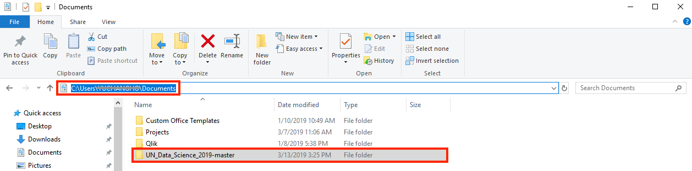

<div style="page-break-after: always;"></div>

## Section 3. Software Installation

In this section, the environment setup for the prepared machine is described. A compressed file name `requirements_image.zip` is provided along with this manual. It contains all the software installation executables needed to get the machine ready. Please uncompress it with a compression software like `IZArc`, `WinRAR`, or `7-zip`.

If the computer does not have a compression software available, `7-zip` is a recommendation. Please use the link: [https://www.7-zip.org/a/7z1900-x64.exe](https://www.7-zip.org/a/7z1900-x64.exe) to download and install it. Visit [https://www.7-zip.org/](https://www.7-zip.org/) if the provided link is not working.

Please extract the content of `requirements_image.zip`. The structure is as follow:
```txt
+-- Dataset for Image Classification/
|   +-- training_imgs/
|   |   +-- female/
|   |   |   +-- (many image files)
|   |   +-- male/
|   |   |   +-- (many image files)
|   |   +-- unknown/
|   |   |   +-- (many image files)
|   +-- freelancer_supply_20190204.csv
|
+-- Installation/
|   +-- Git-2.21.0-64-bit.exe
|   +-- python-3.6.8-amd64.exe
|   +-- cuda_9.0.176_win10_network.exe
|   +-- cudnn_lib/
|   |   +-- bin/
|   |   |   +-- cudnn64_7.dll
|   |   +-- include/
|   |   |   +-- cudnn.h
|   |   +-- lib/
|   |   |   +-- x64/
|   |   |   |   +-- cudnn.lib
|   +-- vc_redist.x64.exe
|   +-- vs_community__881455873.1549905826.exe
```

<div style="page-break-after: always;"></div>

### 3-1. Install Git for Windows

**Git** is the repository syncing service for repository management. In the `requirements_image.zip`, a folder named `Installation` contains `Git-2.21.0-64-bit.exe`, which is for the installation. If the file is not found, please visit [https://git-scm.com/downloads](https://git-scm.com/downloads) and click `Download X.X.X for Windows` to download the executable.

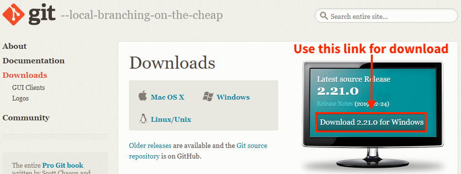

<u>***Procedure***</u>

1. Double-click on `Git-2.21.0-64-bit.exe`, click `Next`:

    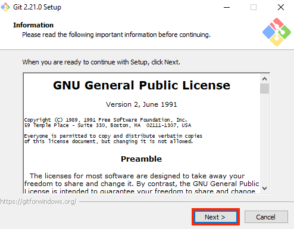

2. Keep click on `Next` until the following page, click `Install`:

    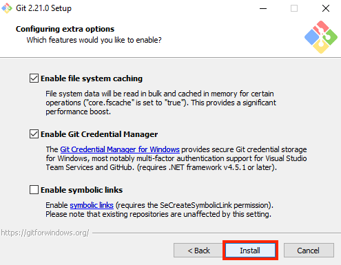

3. Wait until the process complete, **uncheck** all the given options then click `Finish`:

    

<div style="page-break-after: always;"></div>

### 3-2. Install Python 3.6 Environment

**Python** is the programming language used for this project. The file `python-3.6.8-amd64.exe` is available under folder `Installation`. If the file is not found, please visit [https://www.python.org/downloads/release/python-368/](https://www.python.org/downloads/release/python-368/), scroll down to the bottom of the page, and find the download link `Windows x86-64 executable installer`.

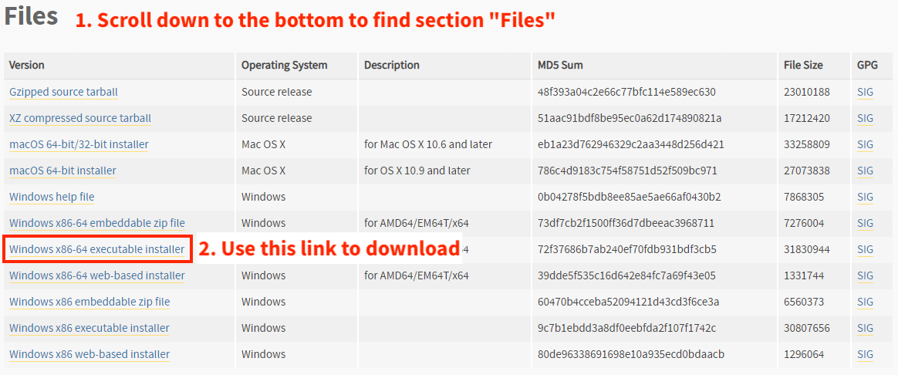

<u>***Procedure***</u>

1. Make sure to **check** `Add Python 3.6 to PATH` then click `Install Now`:

    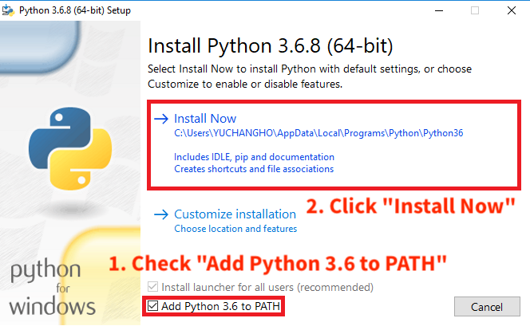

2. Open up an `Windows Powershell` by follow the steps:

    a. Press "`win` key  + `R`" on the keyboard, the following window will be prompted:

    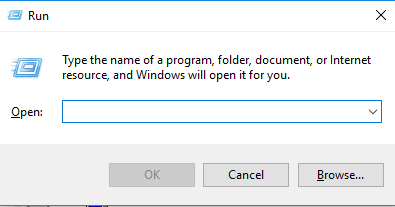

    b. Type `powershell` then hit `Enter`

    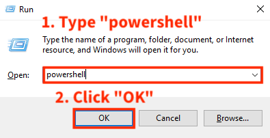

    c. This is the **Windows PowerShell**:

    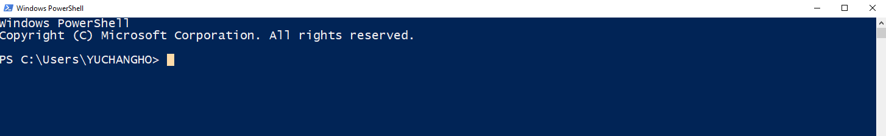

    d. Within the window, type `python` then hit `Enter`:

    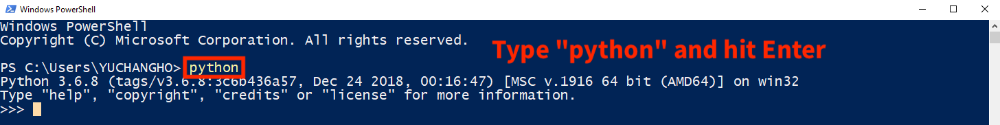

    e. If no error message shows up, type `exit()` to quit the program or simply close the window.

    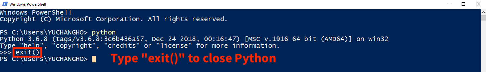

<div style="page-break-after: always;"></div>

### 3-3. Install NVIDIA CUDA 9.0 Library (for Computer with NIVIDA GPU Device Only)

In this sub-section, the NVIDIA CUDA 9.0 library will be installed. It is the library for accerlating the TensorFlow computation while conducting **image classification for gender identification**. Please make sure the working machine has a `compatible NIVIDIA GPU device` equipped. Please refer to [https://www.geforce.com/hardware/technology/cuda/supported-gpus](https://www.geforce.com/hardware/technology/cuda/supported-gpus) for the list of compatible NIVIDA GPU. Also, for the latest updated tutorial for the installation, please refer to the TensorFlow developer site for enabling GPU support for TensorFlow: [https://www.tensorflow.org/install/gpu](https://www.tensorflow.org/install/gpu)

In the given `requirements_image.zip`, an executable named `cuda_9.0.176_win10_network.exe` could be found under folder `Installation`. If the file is not found, please visit [https://developer.nvidia.com/cuda-90-download-archive?target_os=Windows&target_arch=x86_64](https://developer.nvidia.com/cuda-90-download-archive?target_os=Windows&target_arch=x86_64) and use the link `Windows` to download.

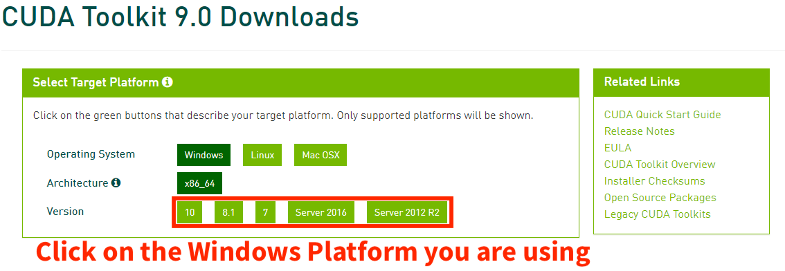

An folder named `cudnn_lib` is also available under the same folder. Those are the requirements for the installation. If `cudnn_lib` is not found, please visit [https://developer.nvidia.com/cudnn](https://developer.nvidia.com/cudnn) and click on the link `Download cuDNN`. It will ask for an valid NVIDIA developer account to proceed to download. Follow the steps below:

1. Click `Download cuDNN`:

    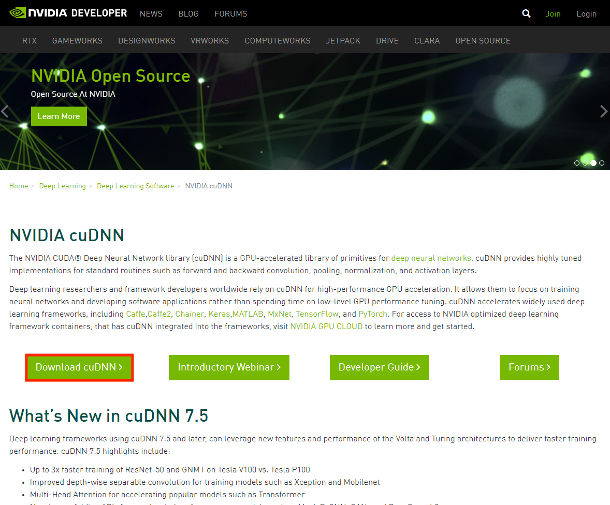

2. Click `Join Now`:

    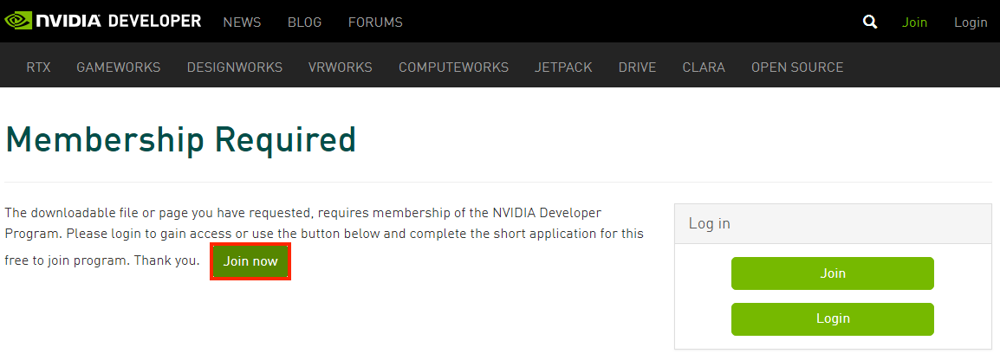

3. Click `Create an account` and then follow the webpage's instructions for account creation:

    

4. After the account is created, head back to [https://developer.nvidia.com/cudnn](https://developer.nvidia.com/cudnn), click on `Download cuDNN` again

5. Check the box to accept the agreement, then find the link for **CUDA 9.0**:

    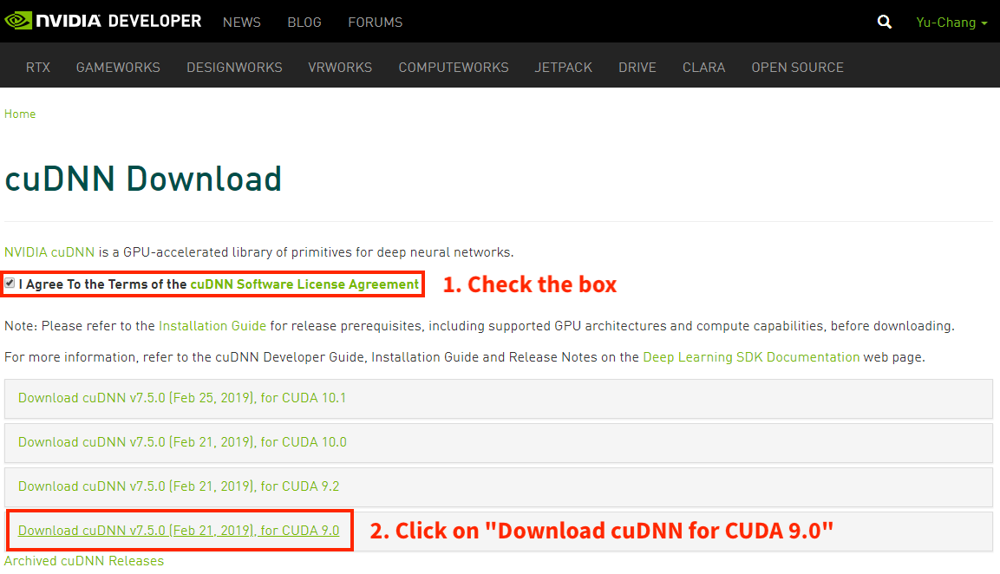

6. Find the link for **Windows 10**:

    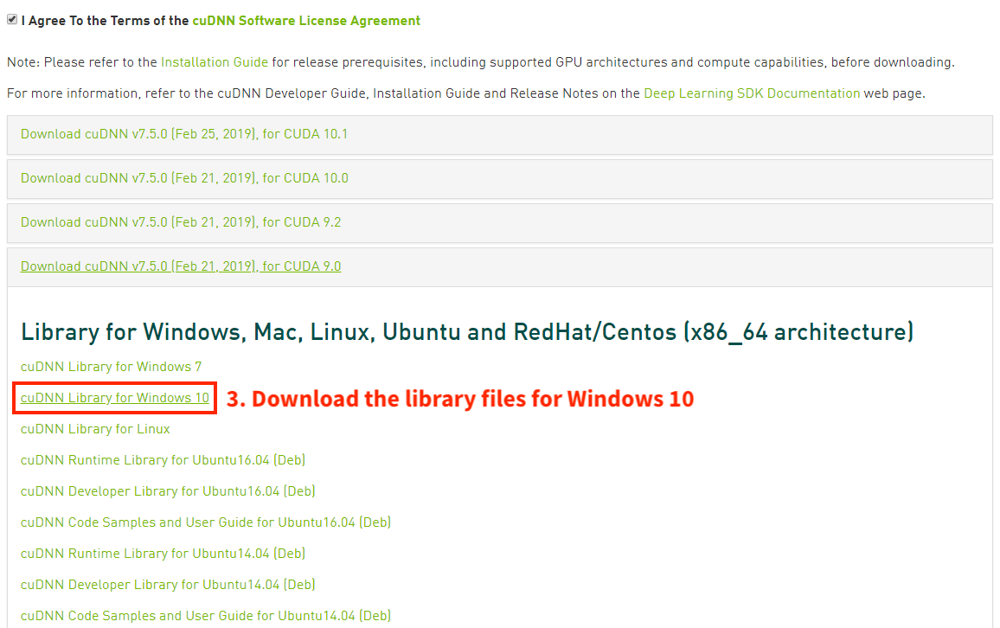

7. The downloaded compressed file could look like this:

    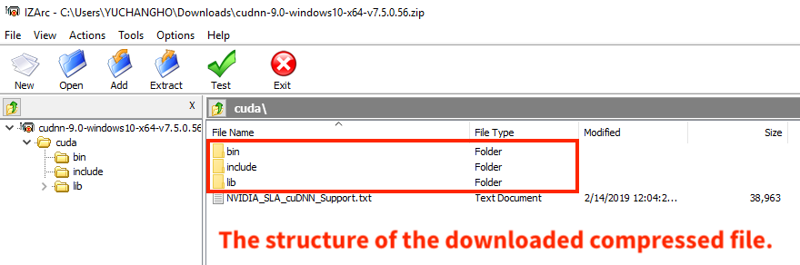

<div style="page-break-after: always;"></div>

#### 3-3-1. Install MS Visual Studio Tools

In the folder `Installation`, two executables, `vc_redist.x64.exe` and `vs_community__881455873.1549905826.exe`, are available. Refer to [https://support.microsoft.com/en-us/help/2977003/the-latest-supported-visual-c-downloads](https://support.microsoft.com/en-us/help/2977003/the-latest-supported-visual-c-downloads) to download `vc_redist.x64.exe` under section `Visual Studio 2017`.

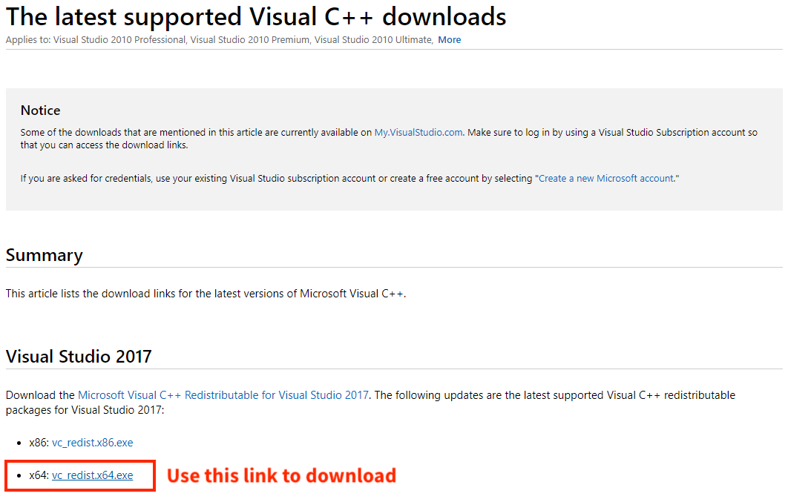

Refer to [https://visualstudio.microsoft.com/downloads/#build-tools-for-visual-studio-2017](https://visualstudio.microsoft.com/downloads/#build-tools-for-visual-studio-2017) to download `vs_community__881455873.1549905826.exe` as follow:

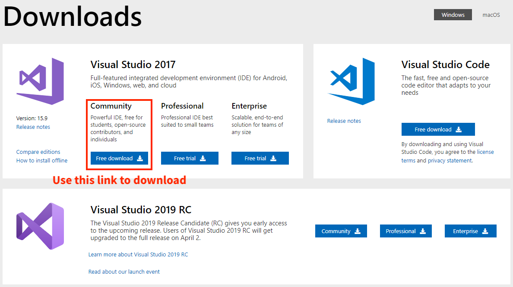

1. Double-click on `vc_redist.x64.exe`, check the box to accept agreement then click `Install`:

    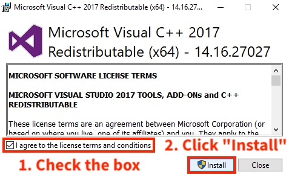

2. Click `Close` to finish the installation:

    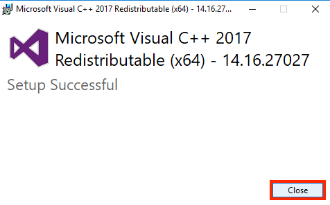

3. Double-click on `vs_community__881455873.1549905826.exe`, click `Continue`:

    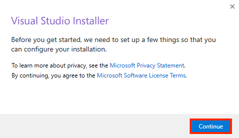

4. Make sure the following **2** options are **checked**, then click `Install`:

    * .NET Desktop Development
    * Desktop development with C++

    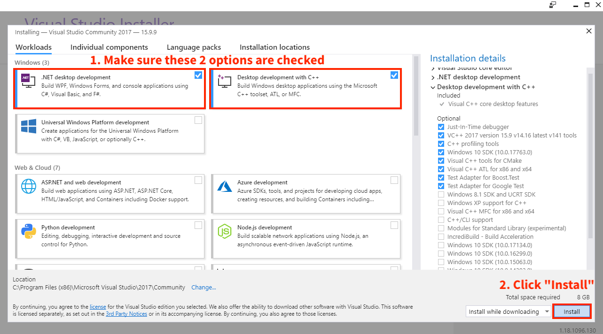

5. Safely close the window after the installation process reach **100%**:

    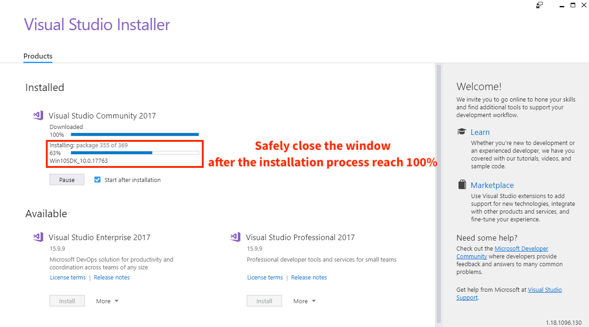

<div style="page-break-after: always;"></div>

#### 3-3-2. Install CUDA 9.0 and cuDNN

1. Double-click on `cuda_9.0.176_win10_network.exe`, then click `OK`:

    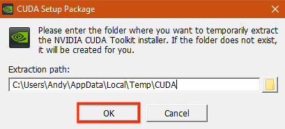

2. Wait for the program to check the system compatibility:

    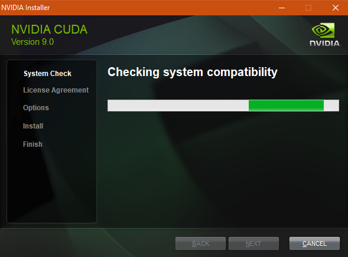

3. Click `AGREE AND CONTINUE`:

    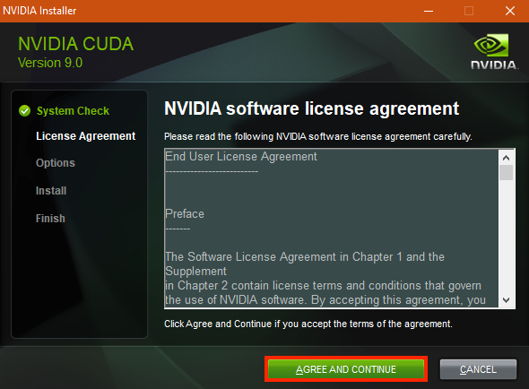

4. Make sure the option `Express` is selected then click `NEXT`:

    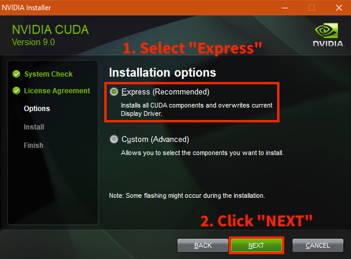

5. Wait for the installation to complete. The screen might go dark for several times during installation. Click `NEXT` if this page shows up:

    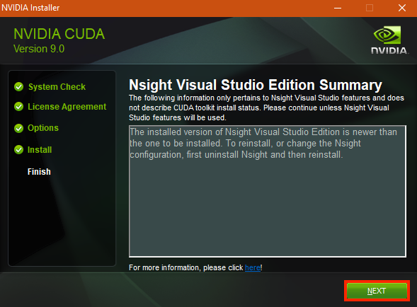

6. **Uncheck** all the given options then click `CLOSE` to finish the installation:

    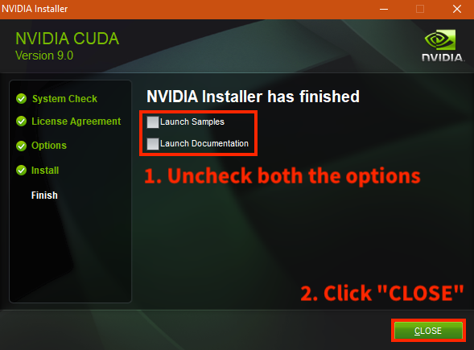

7. Within the folder `cudnn_lib`, **3** folders are given as follow:
    ```txt
    cudnn_lib/
    |   +-- bin/
    |   |   +-- cudnn64_7.dll
    |   +-- include/
    |   |   +-- cudnn.h
    |   +-- lib/
    |   |   +-- x64/
    |   |   |   +-- cudnn.lib
    ```
    a. Open a `File Explorer`

    b. Copy the file `bin/cudnn64_7.dll` into the folder:
    ```bash
    C:\Program Files\NVIDIA GPU Computing Toolkit\CUDA\v9.0\bin
    ```

    c. Copy the file `include/cudnn.h` into the folder:
    ```bash
    C:\Program Files\NVIDIA GPU Computing Toolkit\CUDA\v9.0\include
    ```

    d. Copy the file `lib/x64/cudnn.lib` into the folder:
    ```bash
    C:\Program Files\NVIDIA GPU Computing Toolkit\CUDA\v9.0\lib\x64
    ```

    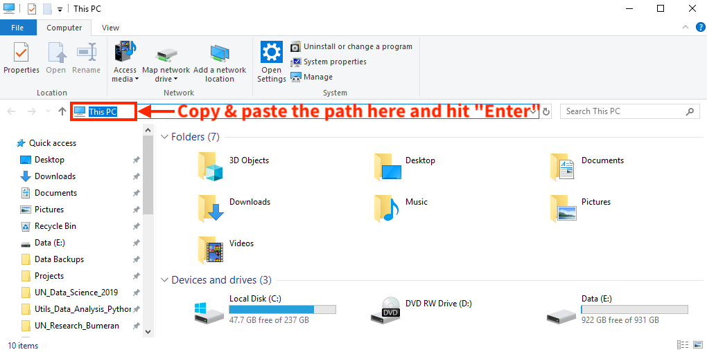

<div style="page-break-after: always;"></div>

#### 3-3-3. Test the GPU Support

1. Open up a `Windows Powershell`, type `python` then hit `Enter`:

    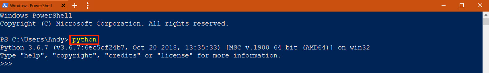

2. Input the following code and hit `Enter`:
    ```python
    import tensorflow as tf
    ```
    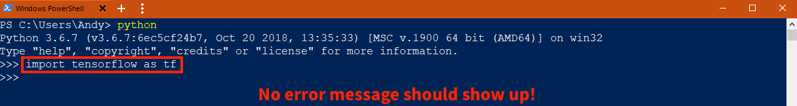

3. Type the following code and hit `Enter`, the name of equipped GPU device should shows up. Here the name of the GPU is `GeForce GTX 1060`:
    ```python
    sess = tf.Session(config=tf.ConfigProto(log_device_placement=True))
    ```
    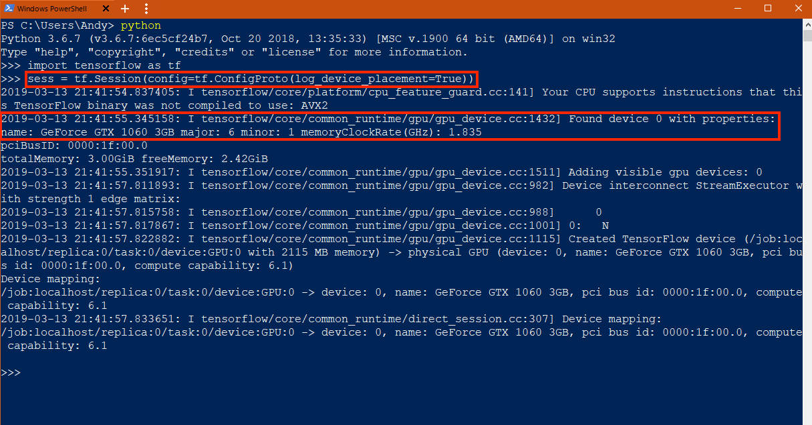

4. If everything works correctly, type `exit()` to close Python or simply close the window.

<div style="page-break-after: always;"></div>

## Section 4. Perform Image Classification for Project **Labor Market Analysis**

> Requirement: ***A machine with a compatible NVIDIA GPU device available & tensorflow-gpu lib. for Python available***

For labor market analysis, one of the objectives is to provide **gender-related analysis**. For **Freelancer** dataset, however, the gender information for each job seeker is not revealed. Therefore, a **TensorFlow-based Machine Learning model** for **image classification** is proposed. The profile pictures of job seekers on Freelancer were already collected within the dataset.

<u>***Procedure***</u>

1. Scraping Profile Pictures:

    To prepare for downloading the profile images, in the extracted folder of the given `requirements_image.zip`, a folder named `Dataset` contains the pre-scraped Freelancer dataset that holds the links to all the profile pictures. Follows:

    a. Copy the file `freelancer_supply_20190204.csv` into the path:
    ```bash
    C:\Users\<user_name>\Documents\UN_Research_Image_Classification_for_Gender-master\labor_market\gender_classification\downloading
    # Change <user_name> to the computer username.
    ```

    b. Open a **Windows Powershell**, then:
    ```bash
    $ cd 'C:\Users\<user_name>\Documents\UN_Research_Image_Classification_for_Gender-master\labor_market\gender_classification\downloading'
    # Change <user_name> to the computer username. Then, run the program:
    $ python run.py -u 1
    ```

    c. The program will prompt to ask for inputing the exact filename of the Freelancer dataset file. Type the following then hit `Enter`:
    ```bash
    ./freelancer_supply_20190204.csv
    ```

2. Performing Image Classification:

    a. Create **1** folder named `imgs` under path:
    ```bash
    C:\Users\<user_name>\Documents\UN_Research_Image_Classification_for_Gender-master\labor_market\gender_classification\
    # Change <user_name> to the computer username.
    ```
    
    b. Place the images which to be classified into that newly created folder.

    c. Under extracted folder of `requirements_image.zip`, the folder `Dataset for Image Classification` contains a folder `training_imgs`. Copy that folder into the same path given above. The folder `training_imgs` has 3 sub-folders, **female**, **male**, and **unknown**. Each of the sub-folders contains nearly ***1000*** pre-classified images. Those images are the training dataset for machine learning model training.

    d. Open a **Windows Powershell**, navigate to the program folder by:
    ```bash
    $ cd C:\Users\<user_name>\Documents\UN_Research_Image_Classification_for_Gender-master\labor_market\gender_classification\classifying
    # Change <user_name> to the computer username.
    ```

    e. Perform model retraining:
    ```bash
    $ python retrain.py --img_dir=../training_imgs
    # Wait until the process complete.
    ```

    f. Finally, perform classification on the target images:
    ```bash
    $ python label_image.py --graph=/tmp/output_graph.pb --labels=/tmp/output_labels.txt \
        --input_layer=Placeholder --output_layer=final_result \
        --start 0 --concurrent 1000 --partition 1000 \
        --img_dir=../imgs/ \
        --data_file=*.jpg \
    # Wait until the process complete.
    ```

